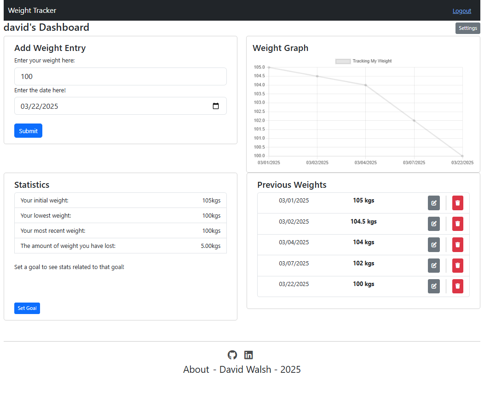

# WebWeightTracker

WebWeightTracker is a simple web application that allows users to register, log in, and track their weight progress over time.



## Features

- User authentication (Registration and Login)
- Track and log weight entries
- View historical weight data
- Responsive and user-friendly interface

## Tech Stack

- **Frontend:** React, React Router
- **Backend:** Node.js, Express
- **Database:** MongoDB
- **Authentication:** JWT (JSON Web Tokens)

## Installation

1. **Clone the Repository:**

   ```bash
   git clone https://github.com/D-Walsh33/WebWeightTracker.git
   cd WebWeightTracker
   ```

2. **Install Dependencies:**

   - Install server dependencies
     ```bash
     cd server
     npm install
     ```
   - Install client dependencies
     ```bash
     cd ../client
     npm install
     ```

3. **Configure Environment Variables:**

   - Create `.env` files in both the server and client directories.
   - **Server (.env)**
     ```env
     PORT=5000
     MONGO_URI=your-mongodb-connection-string
     JWT_SECRET=your-secret-key
     ```
   - **Client (.env)**
     ```env
     VITE_API_URL=your-hosting-url eg: http://localhost:3000
     ```

4. **Build and Start the App:**

   - Build the React app
     ```bash
     cd client
     npm run build
     ```
   - Start the server
     ```bash
     cd ../server
     npm start
     ```

5. **Access the App:**
   - Navigate to `your-hosting-url` in your browser.

## Deployment

If deploying using Render:

- Ensure your `.env` files are set up in Render’s environment variable section.
- Set the build command for the client:
  ```bash
  npm run build --prefix client
  ```
- Update the `VITE_API_URL` to your deployed backend URL.

## Contributing

Feel free to submit issues or pull requests. Contributions are welcome!

---

Happy tracking! 🚀
